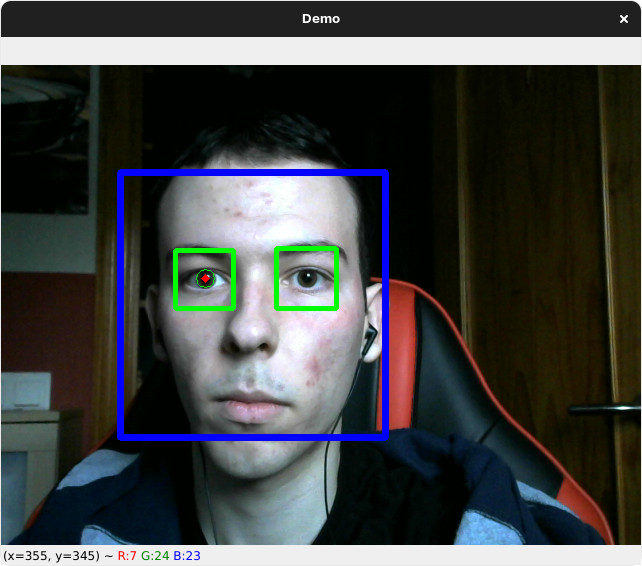

# Mouse-Management-using-OpenCV
In this repository you will find the final project of the Computer Vision subject at the **[University of Málaga](https://www.uma.es/#gsc.tab=0)** fully implemented by the student of Computer Science **[Marcos Hidalgo](https://github.com/MarkosHB)**. 
- [Presentation](./Presentacion.pdf)
- [Project Notebook](./ProyectoFinal.ipynb)

<h3 align="center">
 :arrow_down: Take a look at the expected results! :arrow_down:
</h3>

<p align="center">
  
</p>

> The project was develop with academic porposes and does not represent a proffesional work so it's not a viable tool to use. Due to imprecisions made during the track of the iris, the program does not respond as expected. Nevertheless, the code used to implemented is compleatly functional and needs to be reinforced with advanced CV techniques that I am unable to develop with my current knowledge.

## Installation process and project requirements.
You must have previuslly installed Jupyter Notebook to succesfully run the Python code within it self. Check this **[link](https://docs.jupyter.org/en/latest/install/notebook-classic.html)** to properly install them!
Additionaly, there are function that have to be imported from external libraries manually:

#### _Open Computer Vision library_
Most of the functions used are from OpenCV. If not installed already, just copy paste on the console the following.
```bash
  pip install opencv-python
```

#### _Pynput library_
Our program needs to be able to handle the clicks without using the mouse. With that porpose, Pynput provides us a Controller to detect them allongside some valuable functions and constanst to represent mouse interactions.
```bash
  pip install pynput
```


